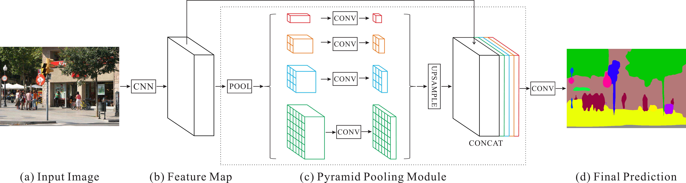
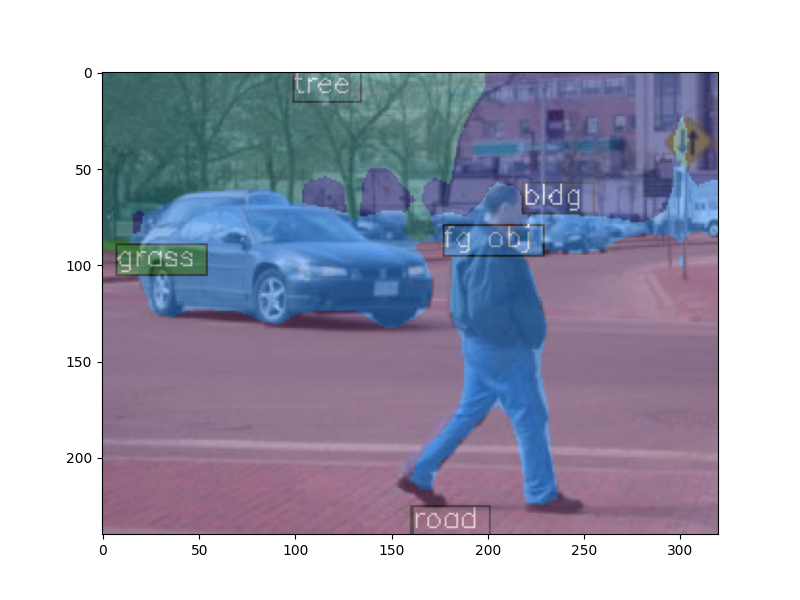
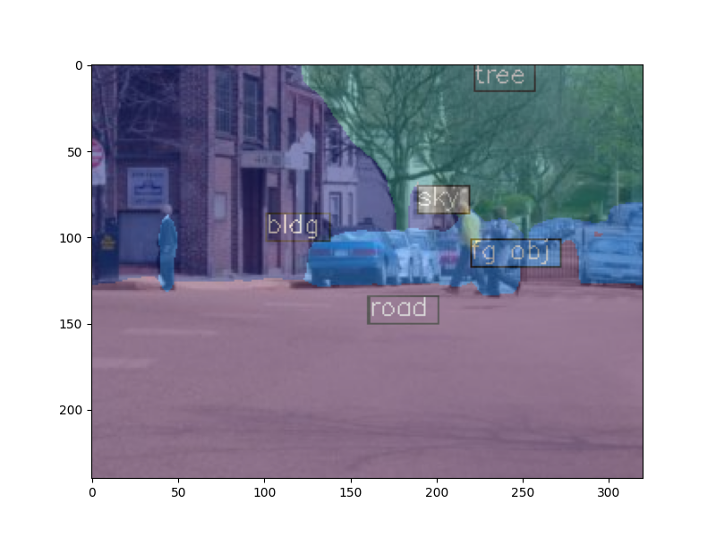
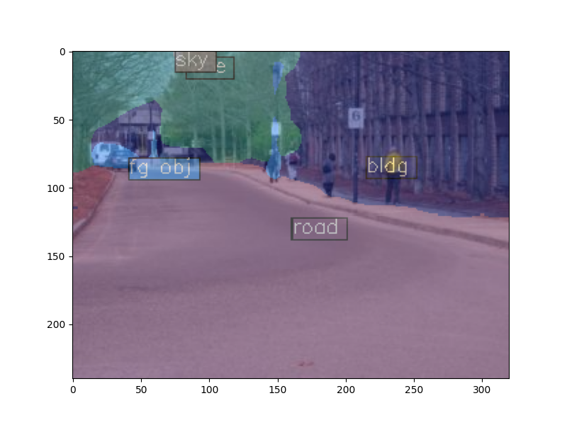
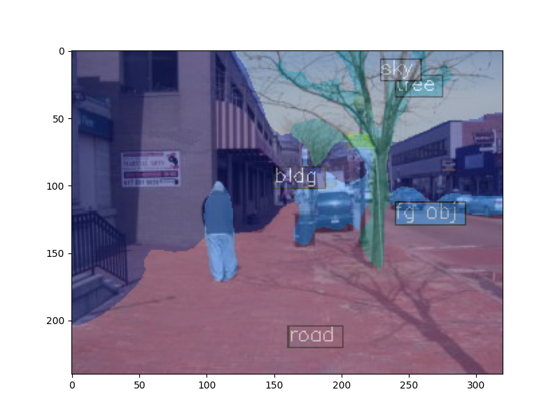

# Custom Segmentation with MMSegmentation

Welcome to this step-by-step guide on setting up and using MMSegmentation, a powerful open-source toolbox for semantic segmentation built on PyTorch. This tutorial will walk you through:

- ✅ Setting up a Conda environment and installing dependencies
- ✅ Downloading and running inference with a pretrained model 
- ✅ Adding a new dataset for training 
- ✅ Configuring and training a custom segmentation model

We will use the Stanford Background Dataset with PSPNet for semantic segmentation as an example, showcasing how to preprocess data, modify configurations, and fine-tune a segmentation model.

Whether you're a beginner or an experienced ML practitioner, this tutorial will help you get up and running with MMSegmentation quickly. Let’s dive in! 🚀





### Let's create a new conda environment and install MMSegmentation

- **Create a new conda environment**

```
conda create -n mmseg_env python=3.8 -y
conda activate mmseg_env
```

- **Check nvcc version**

```nvcc -V```

- **Install Pytorch.** I reccomend following the [official guide](https://pytorch.org/) for this step.

```
pip install torch torchvision torchaudio --index-url https://download.pytorch.org/whl/cu117
```


- **Install openmim mmengine and MMCV.** You can follow the [official guide](https://github.com/open-mmlab/mmsegmentation/blob/master/docs/en/get_started.md#installation) (or the [tutorial](https://github.com/open-mmlab/mmsegmentation/blob/master/demo/MMSegmentation_Tutorial.ipynb)).
```
pip install openmim
pip install mmengine
pip install mmcv==2.1.0 -f https://download.openmmlab.com/mmcv/dist/cu117/torch2.0/index.html
```

- **Install mmsegmentation from source**
```
git clone https://github.com/open-mmlab/mmsegmentation.git 
cd mmsegmentation
pip install -e .
```

- **Check installations**
```python
# Check Pytorch installation
import torch, torchvision
print(torch.__version__, torch.cuda.is_available())

# Check MMSegmentation installation
import mmseg
print(mmseg.__version__)
```


### Download a pretrained model and run inference

- **Download the pretrained model**
```
mim download mmsegmentation --config pspnet_r50-d8_4xb2-40k_cityscapes-512x1024 --dest .
```


- **Run Inference with MMSeg trained weight**, either using:
```
python demo/image_demo.py demo/demo.png configs/pspnet/pspnet_r50-d8_4xb2-40k_cityscapes-512x1024.py pspnet_r50-d8_512x1024_40k_cityscapes_20200605_003338-2966598c.pth --device cuda:0 --out-file result.jpg
```

or using the following code (`./demo.py`):

```python
import torch
from mmseg.apis import inference_model, init_model, show_result_pyplot
import mmcv

# Check installations
print(torch.__version__, torch.cuda.is_available())
import mmseg
print(mmseg.__version__)

# Run Inference with MMSeg trained weight
config_file = './configs/pspnet/pspnet_r50-d8_4xb2-40k_cityscapes-512x1024.py'
checkpoint_file = 'pspnet_r50-d8_512x1024_40k_cityscapes_20200605_003338-2966598c.pth'

# build the model from a config file and a checkpoint file
model = init_model(config_file, checkpoint_file, device='cuda:0')

# test a single image and show the results
img = 'demo/demo.png'  # or img = mmcv.imread(img), which will only load it once
result = inference_model(model, img)
# visualize the results in a new window
show_result_pyplot(model, img, result, show=True)
# or save the visualization results to image files
# you can change the opacity of the painted segmentation map in (0, 1].
show_result_pyplot(model, img, result, show=True, out_file='result.jpg', opacity=0.5)
# test a video and show the results
video = mmcv.VideoReader('./video/video.mp4')
for frame in video:
   result = inference_model(model, frame)
   show_result_pyplot(model, frame, result, wait_time=0.1)
```

### Add a new dataset

Datasets in MMSegmentation require image and semantic segmentation maps to be placed in folders with the same prefix. To support a new dataset, we may need to modify the original file structure.

In this tutorial, we give an example of converting the dataset. You may refer to docs for details about dataset reorganization.

We use Stanford Background Dataset as an example. The dataset contains 715 images chosen from existing public datasets LabelMe, MSRC, PASCAL VOC and Geometric Context. Images from these datasets are mainly outdoor scenes, each containing approximately 320-by-240 pixels. In this tutorial, we use the region annotations as labels. There are 8 classes in total, **i.e. sky, tree, road, grass, water, building, mountain, and foreground object**.

- **Download the dataset**
```
curl -o stanford_background.tar.gz http://dags.stanford.edu/data/iccv09Data.tar.gz
```

- **Extract the dataset**
```
# unzip manually or use the following command:
tar xf stanford_background.tar.gz
```

- **Let's take a look at the dataset.** Refer to `convert_dataset.py` for the complete code.

```python
import mmcv
import matplotlib.pyplot as plt

img = mmcv.imread('iccv09Data/images/6000124.jpg')
plt.figure(figsize=(8, 6))
plt.imshow(mmcv.bgr2rgb(img))
plt.show()
```


- **We need to convert the annotation into semantic map format as an image.** 
  - MMSegmentation expects annotation masks in an indexed (P-mode) format rather than regular RGB images. We can convert the annotation files to indexed images using the following code (I have also included a stand-alone helper script to handle conversion if you have masks in an image format, see `./helpers/convert_masks_to_palette_based_png.py`).:

```python
import mmcv
import matplotlib.pyplot as plt
import os.path as osp
import os
import numpy as np
from PIL import Image
from mmengine.utils import scandir
import matplotlib.patches as mpatches

# convert dataset annotation to semantic segmentation map
data_root = 'iccv09Data'
img_dir = 'images'
ann_dir = 'labels'
# define class and plaette for better visualization
classes = ('sky', 'tree', 'road', 'grass', 'water', 'bldg', 'mntn', 'fg obj')
palette = [[128, 128, 128], [129, 127, 38], [120, 69, 125], [53, 125, 34], 
           [0, 11, 123], [118, 20, 12], [122, 81, 25], [241, 134, 51]]


# for file in mmcv.scandir(osp.join(data_root, ann_dir), suffix='.regions.txt'):
for file in scandir(osp.join(data_root, ann_dir), suffix='.regions.txt'):
  seg_map = np.loadtxt(osp.join(data_root, ann_dir, file)).astype(np.uint8)
  seg_img = Image.fromarray(seg_map).convert('P')
  seg_img.putpalette(np.array(palette, dtype=np.uint8))
  seg_img.save(osp.join(data_root, ann_dir, file.replace('.regions.txt', '.png')))

```


- **Let's take a look at the segmentation map we got**

```python
import matplotlib.patches as mpatches

img = Image.open('iccv09Data/labels/6000124.png')
plt.figure(figsize=(8, 6))
im = plt.imshow(np.array(img.convert('RGB')))

# create a patch (proxy artist) for every color 
patches = [mpatches.Patch(color=np.array(palette[i])/255., 
                          label=classes[i]) for i in range(8)]
# put those patched as legend-handles into the legend
plt.legend(handles=patches, bbox_to_anchor=(1.05, 1), loc=2, borderaxespad=0., 
           fontsize='large')

plt.show()
```

- **split train/val set randomly**

```python
# split train/val set randomly
split_dir = 'splits'
# mmcv.mkdir_or_exist(osp.join(data_root, split_dir))
os.makedirs(osp.join(data_root, split_dir), exist_ok=True)
# filename_list = [osp.splitext(filename)[0] for filename in mmcv.scandir(osp.join(data_root, ann_dir), suffix='.png')]
filename_list = [osp.splitext(filename)[0] for filename in scandir(osp.join(data_root, ann_dir), suffix='.png')]

with open(osp.join(data_root, split_dir, 'train.txt'), 'w') as f:
  # select first 4/5 as train set
  train_length = int(len(filename_list)*4/5)
  f.writelines(line + '\n' for line in filename_list[:train_length])
with open(osp.join(data_root, split_dir, 'val.txt'), 'w') as f:
  # select last 1/5 as train set
  f.writelines(line + '\n' for line in filename_list[train_length:])
```

### Training a custom segmentation model
Here we will train a PSPNet model on the Stanford Background Dataset. We will define a new dataset class, modify the configuration file, and train the model. Refer to `train.py` for the complete code.

- **Define and register a new dataset**
```python
from mmseg.registry import DATASETS
from mmseg.datasets import BaseSegDataset


# define dataset root and directory for images and annotations
data_root = 'iccv09Data'
img_dir = 'images'
ann_dir = 'labels'
# define class and palette for better visualization
classes = ('sky', 'tree', 'road', 'grass', 'water', 'bldg', 'mntn', 'fg obj')
palette = [[128, 128, 128], [129, 127, 38], [120, 69, 125], [53, 125, 34],
           [0, 11, 123], [118, 20, 12], [122, 81, 25], [241, 134, 51]]


####################################################
# define dataset class for Stanford Background
####################################################
@DATASETS.register_module()
class StanfordBackgroundDataset(BaseSegDataset):
  METAINFO = dict(classes = classes, palette = palette)
  def __init__(self, **kwargs):
    super().__init__(img_suffix='.jpg', seg_map_suffix='.png', **kwargs)
```

- **Load and modify the configuration file**
```python
from mmengine import Config

##################################################
# let's load and modify the config file
##################################################
cfg = Config.fromfile('configs/pspnet/pspnet_r50-d8_4xb2-40k_cityscapes-512x1024.py')
print(f'Config:\n{cfg.pretty_text}')

# Since we use only one GPU, BN is used instead of SyncBN
cfg.norm_cfg = dict(type='BN', requires_grad=True)
cfg.crop_size = (256, 256)
cfg.model.data_preprocessor.size = cfg.crop_size
cfg.model.backbone.norm_cfg = cfg.norm_cfg
cfg.model.decode_head.norm_cfg = cfg.norm_cfg
cfg.model.auxiliary_head.norm_cfg = cfg.norm_cfg
# modify num classes of the model in decode/auxiliary head
cfg.model.decode_head.num_classes = 8
cfg.model.auxiliary_head.num_classes = 8

# Modify dataset type and path
cfg.dataset_type = 'StanfordBackgroundDataset'
cfg.data_root = data_root

cfg.train_dataloader.batch_size = 4 #8

cfg.train_pipeline = [
    dict(type='LoadImageFromFile'),
    dict(type='LoadAnnotations'),
    dict(type='RandomResize', scale=(320, 240), ratio_range=(0.5, 2.0), keep_ratio=True),
    dict(type='RandomCrop', crop_size=cfg.crop_size, cat_max_ratio=0.75),
    dict(type='RandomFlip', prob=0.5),
    dict(type='PackSegInputs')
]

cfg.test_pipeline = [
    dict(type='LoadImageFromFile'),
    dict(type='Resize', scale=(320, 240), keep_ratio=True),
    # add loading annotation after ``Resize`` because ground truth
    # does not need to do resize data transform
    dict(type='LoadAnnotations'),
    dict(type='PackSegInputs')
]


cfg.train_dataloader.dataset.type = cfg.dataset_type
cfg.train_dataloader.dataset.data_root = cfg.data_root
cfg.train_dataloader.dataset.data_prefix = dict(img_path=img_dir, seg_map_path=ann_dir)
cfg.train_dataloader.dataset.pipeline = cfg.train_pipeline
cfg.train_dataloader.dataset.ann_file = 'splits/train.txt'

cfg.val_dataloader.dataset.type = cfg.dataset_type
cfg.val_dataloader.dataset.data_root = cfg.data_root
cfg.val_dataloader.dataset.data_prefix = dict(img_path=img_dir, seg_map_path=ann_dir)
cfg.val_dataloader.dataset.pipeline = cfg.test_pipeline
cfg.val_dataloader.dataset.ann_file = 'splits/val.txt'

cfg.test_dataloader = cfg.val_dataloader

# Load the pretrained weights
cfg.load_from = 'pspnet_r50-d8_512x1024_40k_cityscapes_20200605_003338-2966598c.pth'

# Set up working dir to save files and logs.
cfg.work_dir = './work_dirs/tutorial'

cfg.train_cfg.max_iters = 1000 #200
cfg.train_cfg.val_interval = 500 #200
cfg.default_hooks.logger.interval = 10
cfg.default_hooks.checkpoint.interval = 200

# cfg.train_dataloader.num_workers = 4
# cfg.val_dataloader.num_workers = 4
# cfg.test_dataloader.num_workers = 4

# Set seed to facilitate reproducing the result
cfg['randomness'] = dict(seed=0)

# Let's have a look at the final config used for training
print(f'Config:\n{cfg.pretty_text}')
```

- **Train the model**
```python
from mmengine.runner import Runner
# Run training
runner = Runner.from_cfg(cfg)
runner.train()
```

### Test the model

Here we will test the trained model on a sample image from the dataset. Refer to `test.py` for the complete code.

```python
# Run testing
from mmseg.apis import init_model, inference_model, show_result_pyplot
import mmcv
import matplotlib.pyplot as plt

# inference with trained model
# Init the model from the config and the checkpoint
checkpoint_path = './work_dirs/tutorial/iter_200.pth'
model = init_model(cfg, checkpoint_path, 'cuda:0')

img = mmcv.imread('./iccv09Data/images/6000124.jpg')
result = inference_model(model, img)
plt.figure(figsize=(8, 6))
vis_result = show_result_pyplot(model, img, result)
plt.imshow(mmcv.bgr2rgb(vis_result))
plt.show()
```

## Segmentation Results

Below are the Intersection over Union (IoU) and Accuracy (Acc) results for each class:

| Class  |  IoU (%) |  Acc (%) |
|--------|---------|---------|
| Sky    | 87.71   | 91.04   |
| Tree   | 68.34   | 79.82   |
| Road   | 89.29   | 95.95   |
| Grass  | 77.29   | 83.47   |
| Water  | 78.92   | 85.91   |
| Bldg   | 75.41   | 90.72   |
| Mntn   | 32.13   | 54.24   |
| Fg Obj | 68.24   | 78.41   |


## Visualization Results

Here are four sample results from the segmentation model:

<div align="center">
  <table>
    <tr>
      <td></td>
      <td></td>
    </tr>
    <tr>
      <td></td>
      <td></td>
    </tr>
  </table>
</div>


## MMSegmentation Model Zoo

MMsegmentation provides a wide range of pre-trained models for semantic segmentation tasks. Here are some popular models available in the MMSegmentation Model Zoo:

| Model       | Description                                                                                          | Configuration Link                                                                                                                                   |
|-------------|------------------------------------------------------------------------------------------------------|------------------------------------------------------------------------------------------------------------------------------------------------------|
| FCN         | Fully Convolutional Network for semantic segmentation.                                               | [FCN Configurations](https://github.com/open-mmlab/mmsegmentation/tree/main/configs/fcn)                                                             |
| PSPNet      | Pyramid Scene Parsing Network for scene understanding.                                               | [PSPNet Configurations](https://github.com/open-mmlab/mmsegmentation/tree/main/configs/pspnet)                                                        |
| DeepLabV3   | Atrous Spatial Pyramid Pooling for semantic image segmentation.                                      | [DeepLabV3 Configurations](https://github.com/open-mmlab/mmsegmentation/tree/main/configs/deeplabv3)                                                  |
| DeepLabV3+  | Enhanced DeepLabV3 with encoder-decoder structure for better segmentation results.                   | [DeepLabV3+ Configurations](https://github.com/open-mmlab/mmsegmentation/tree/main/configs/deeplabv3plus)                                             |
| UPerNet     | Unified Perceptual Parsing for scene segmentation tasks.                                             | [UPerNet Configurations](https://github.com/open-mmlab/mmsegmentation/tree/main/configs/upernet)                                                      |
| SegFormer   | A simple and efficient design for semantic segmentation with Transformers.                           | [SegFormer Configurations](https://github.com/open-mmlab/mmsegmentation/tree/main/configs/segformer)                                                  |
| Mask2Former | A universal segmentation architecture for image and video segmentation tasks.                        | [Mask2Former Configurations](https://github.com/open-mmlab/mmsegmentation/tree/main/configs/mask2former)                                              |
| HRNet       | High-Resolution Network for accurate and detailed semantic segmentation.                             | [HRNet Configurations](https://github.com/open-mmlab/mmsegmentation/tree/main/configs/hrnet)                                                          |
| OCRNet      | Object-Contextual Representations for semantic segmentation.                                         | [OCRNet Configurations](https://github.com/open-mmlab/mmsegmentation/tree/main/configs/ocrnet)                                                        |
| Fast-SCNN   | Fast Semantic Segmentation Network for real-time segmentation on mobile devices.                     | [Fast-SCNN Configurations](https://github.com/open-mmlab/mmsegmentation/tree/main/configs/fastscnn)                                                   |

*Note: For a comprehensive list of models and their configurations, please refer to the [MMSegmentation Model Zoo](https://mmsegmentation.readthedocs.io/en/latest/model_zoo.html).*


## Adapting the Tutorial for Different Models

To use a model other than PSPNet in this tutorial, you need to:

1. **Modify the Configuration File**: Replace the PSPNet configuration with the desired model's configuration file. For example, to use DeepLabV3+, download its configuration from the [DeepLabV3+ Configurations](https://github.com/open-mmlab/mmsegmentation/tree/main/configs/deeplabv3plus) and update the paths accordingly.

2. **Download the Pre-trained Weights**: Obtain the pre-trained weights corresponding to the chosen model. You can find the appropriate weights in the model's configuration directory or the [MMSegmentation Model Zoo](https://mmsegmentation.readthedocs.io/en/latest/model_zoo.html).

3. **Update the Code**: Ensure that the code references the new configuration file and pre-trained weights. Adjust any model-specific parameters as needed.

By following these steps, you can seamlessly switch to different models within the MMSegmentation framework. 🚀


## About This Tutorial

This tutorial is based on **MMSegmentation** by OpenMMLab, a powerful open-source toolbox for semantic segmentation. You can find their official repository here: [MMSegmentation GitHub](https://github.com/open-mmlab/mmsegmentation) and their official tutorial here: [MMSegmentation Tutorial](https://github.com/open-mmlab/mmsegmentation/blob/master/demo/MMSegmentation_Tutorial.ipynb).

